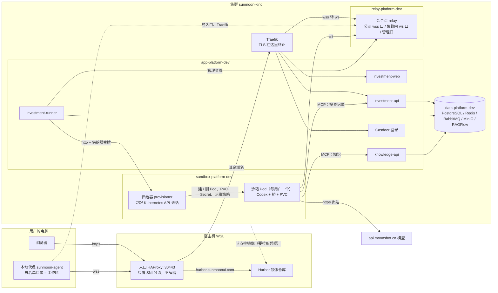

# 拓扑：用户、本地代理、沙箱、会合点、供给器

一次「工作」要经过哪些东西，各在哪、各管什么。只讲 investment 的沙箱这条线；平台服务（数据库、消息、对象存储）只画成一块。端口和名字以各组件目录的 `config.yaml` 为准，这里不重复数值。

## 图



看不了 Mermaid 时看这张：

```text
   用户的电脑                      宿主机 (WSL)                      集群 sunmoon-kind
   浏览器 ──https──┐        ┌─ harbor.* ─► Harbor ◄── 节点拉镜像      app-platform-dev
   本地代理 ──wss──┼► 入口 ─┤                                        ┌ investment-web / api / runner
   (白名单目录)     │ :30443 └─ 其余域名 ─► Traefik ─┬──────────────► │ knowledge-api、Casdoor
                   │                               │                 └──────┬───────────┬──────
                   │                               │   relay-platform-dev   │ http+令牌  │ 管理令牌
                   │                               └──wss►┌───────────┐     ▼           ▼
                   └ ─ ─ ─ ─ ─ ─ ─ ─ ─ ─ ─ ─ ─ ─ ─ ─ ─ ─ ─►│  会合点    │◄──ws── 沙箱 Pod ◄──建/删── 供给器
                                                          └───────────┘        │ (Codex+桥+PVC)   (只跟 K8s API 说话)
                                                                               ├─ MCP ─► investment-api / knowledge-api
                                                                               └─ https ─► api.moonshot.cn
```

## 各管什么

| 东西 | 在哪 | 管什么 | 不管什么 |
| --- | --- | --- | --- |
| 浏览器 | 用户电脑 | 登录、登记 key、拉沙箱、发话、看结果 | 不碰文件 |
| 本地代理 | 用户电脑 | 让沙箱里的 Codex 读写白名单目录里的文件；上限（只读 / 只改白名单 / 不设限、联不联网）在它这边定 | 不跑模型、不存 key |
| 入口 HAProxy | 宿主机 | 一个 30443 端口按域名分流：Harbor 去 Harbor，其余去集群 | 不解密、不认证 |
| Traefik | 集群 | 终止 TLS，按域名路由到各服务；会合点的公网 wss 口也在它后面 | |
| 会合点 relay | 集群 | 把沙箱（集群内 ws）和本地代理（公网 wss）按用户配对；runner 经它的管理口给沙箱下指令 | 不存文件、不跑模型 |
| 供给器 provisioner | 集群 | 按 runner 的请求给用户建 / 删沙箱 Pod、PVC、Secret、网络策略；只认一个令牌，只会建这一种东西 | 不和本地代理通信 |
| 沙箱 Pod | 集群，每用户一个 | 跑 Codex；模型 key、会话记录在它的 PVC 里；查数据走 MCP；调模型走出站 https | 碰不到别的用户、碰不到集群别的东西（网络策略） |
| investment-runner | 集群 | 工作台的执行者：拉沙箱、下指令、收事件、算费用 | |
| investment-api / knowledge-api | 集群 | 网页接口；给沙箱提供 MCP（投资记录、知识） | |

## 一次「工作」的顺序

1. 浏览器经入口到 investment-web / api，Casdoor 登录；设置里登记模型 key（后端用 Fernet 加密存库）。
2. 点「拉起沙箱」：runner 拿供给器令牌叫供给器建沙箱 Pod。第一次会给一条本地代理的接入命令，只显示一次。
3. 沙箱起来后，里面的桥用集群内 ws 连会合点；用户在电脑上跑本地代理，用公网 wss 连同一个会合点；两边按用户配对。本地代理里加的白名单目录就是工作区，项目是工作区下的子目录。
4. 用户在项目里发话：runner 经会合点的管理口把指令交给沙箱里的 Codex。Codex 要读写文件时经会合点转到本地代理，只能动白名单目录。
5. Codex 查我们的数据走 MCP（投资记录找 investment-api，知识找 knowledge-api）；调模型走出站 https。

两条线是用户能感知的：浏览器那条，本地代理那条。本地代理是主动连出去的，用户电脑不开端口。

## 为什么要供给器，不让 investment 后端直接建 Pod

建 Pod 的权限给到应用后端，应用一旦被打穿就能在集群里随便建东西。把这个权限收在一个只认一个令牌、只会建沙箱 Pod 的小服务里，应用后端只能让它「给这个用户建一个」。代价是多一个组件。

## 相关

- 沙箱、供给器、会合点的声明：`gitops/components/sandbox-platform/`、`gitops/components/relay-platform/`
- 源码：`sunmoonai/sandbox-platform/`、`sunmoonai/relay-platform/`；本地代理在 `runtime` 仓
- 产品层面的工作区 / 项目 / 机器：`sunmoonai/docs/dev-investment-agent/tree-build/PRD/apps/investment.md`
- 入口分流与域名：`infrastructure/entry/README.md`
