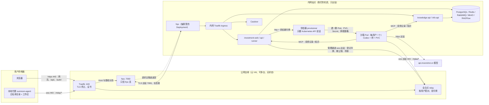
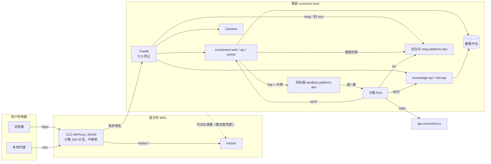

# 拓扑：用户、边缘、内网、本地代理、沙箱、会合点、供给器

正式拓扑是「公网边缘 + 内网站点」，边缘与内网之间靠 frp 隧道，裁定与细节在 [`SDD/architecture/topology.md`](../sunmoonai/docs/dev-investment-agent/tree-build/SDD/architecture/topology.md)。这里只画图、讲职责，并标出现网 `sunmoon-kind` 现在做到了哪一步。端口和名字以各组件目录的 `config.yaml` 为准。

## 一、正式拓扑（所有者 2026-09-26 定：开发期这样，服务用户也这样）

三个地方，两条不变量：**深处只出站**（内网和用户电脑只发起连接，不接受连接），**边缘无状态**（边缘不存业务数据，任一台可替换）。

| 流量 | 走哪 | 为什么 |
| --- | --- | --- |
| 浏览器能到的一切 HTTP（网页、`/api/`、`/auth/`） | 边缘 Traefik → frps → 隧道 → 内网 frpc → 内网 ingress | 内网不开入站端口，HTTP 由内网主动连出来的长连接送回 |
| 本地代理、沙箱、工作台管理通道 | 直接 wss 到边缘上的会合点，不经 frp | 会合点要按用户验令牌、配对、核两端 Codex 版本，frp 做不了 |
| `/mcp/` | 第一期不对外，沙箱在内网直连 | 以后内网外有消费者再开 |
| 边缘公网端口 | 只开 443 和 7000 | 其余都只绑 127.0.0.1 |

## 二、现网 `sunmoon-kind` 现在的样子（2026-10-06）

还没有边缘：会合点在集群里，入口是宿主上的 HAProxy，公网口是 30443，没有 frp。浏览器和本地代理都直接连宿主。这是过渡形态。边缘放哪已定（2026-10-06）：远程助手所在的东京云 VM；域名解析与证书待定（`D19`）。

从现网到正式拓扑要加的：一台边缘（Traefik、会合点、frps）；集群里加 frpc 这个部署单元；会合点从集群搬到边缘（或边缘上再跑一个，集群里的退役）；域名解析指向边缘；入口 HAProxy 退役。协议和组件声明不变，改的是部署清单，这是 `C-T9` 保证的。

## 三、各管什么

| 东西 | 在哪 | 管什么 | 不管什么 |
| --- | --- | --- | --- |
| 浏览器 | 用户电脑 | 登录、登记 key、拉沙箱、发话、看结果 | 不碰文件 |
| 本地代理 | 用户电脑 | 让沙箱里的 Codex 读写白名单目录里的文件；上限（只读 / 只改白名单 / 不设限、联不联网）在它这边定 | 不跑模型、不存 key；不开端口，只连出去 |
| 边缘 Traefik | 边缘 | 终止 TLS，按域名和路径分流：HTTP 给 frps，`/relay/*` 给会合点 | 不存任何业务状态 |
| frps / frpc | 边缘 / 内网 | 把浏览器的 HTTP 请求沿内网连出来的长连接送回内网 | 不验用户、不配对 |
| 会合点 relay | 边缘（现网暂在集群） | 把沙箱和本地代理按用户配对；验令牌（公钥就地验）；给 runner 一个管理口 | 不存文件、不跑模型 |
| 供给器 provisioner | 内网集群 | 按 runner 的请求给用户建 / 删沙箱 Pod、PVC、Secret、网络策略；只认一个令牌，只会建这一种东西 | 不和本地代理通信 |
| 沙箱 Pod | 内网集群，每用户一个 | 跑 Codex；模型 key、会话记录在它的 PVC 里；查数据走 MCP；调模型走出站 https | 碰不到别的用户、碰不到集群别的东西（网络策略） |
| investment-runner | 内网集群 | 工作台管理者：拉沙箱、下指令、收事件、算费用 | |
| investment-api / knowledge-api | 内网集群 | 网页接口；给沙箱提供 MCP（投资记录、知识） | |

## 四、一次「工作」的顺序

1. 浏览器经边缘、隧道到 investment-web / api，Casdoor 登录；设置里登记模型 key（后端用 Fernet 加密存库）。
2. 点「拉起沙箱」：runner 拿供给器令牌叫供给器建沙箱 Pod。第一次会给一条本地代理的接入命令，只显示一次。
3. 沙箱起来后，里面的桥用 wss 连会合点；用户在电脑上跑本地代理，也用 wss 连同一个会合点；两边按用户配对。本地代理里加的白名单目录就是工作区，项目是工作区下的子目录。
4. 用户在项目里发话：runner 经会合点的管理口把指令交给沙箱里的 Codex。Codex 要读写文件时经会合点转到本地代理，只能动白名单目录。
5. Codex 查我们的数据走 MCP（投资记录找 investment-api，知识找 knowledge-api）；调模型走出站 https。

## 五、为什么要供给器，不让 investment 后端直接建 Pod

建 Pod 的权限给到应用后端，应用一旦被打穿就能在集群里随便建东西。把这个权限收在一个只认一个令牌、只会建沙箱 Pod 的小服务里，应用后端只能让它「给这个用户建一个」。代价是多一个组件。

## 名字对照

| 代码里 / 仓库名 | 文档和页面里的叫法 | 是什么 |
| --- | --- | --- |
| `runtime` 仓（将改名 `agent`），包 `@sunmoon/agent`，命令 `sunmoon-agent` | 本地代理 | 装在用户电脑上的程序 |
| `relay-platform/relay` | 会合点 | 平台组件：配对、验令牌、透传 |
| `sandbox-platform/sandbox` | 沙箱 | 每用户一个 Pod，里面跑 Codex |
| `sandbox-platform/provisioner` | 供给器 | 建、删沙箱 |
| `investment-app` | investment 应用 | 后端 + 网页端 + 管理端 |
| investment 后端进程 `api` | 网页接口 | 浏览器和 MCP 调的 HTTP 接口 |
| investment 后端进程 `worker` | 工作进程 | Celery 任务：采集、投递、评测这类后台活 |
| investment 后端进程 `scheduler` | 定时器 | Celery beat，按时触发任务 |
| investment 后端进程 `runner`（Pod `investment-runner`；将改名 `manager`，账 53） | 工作台管理者 | 连沙箱、下指令、收事件、算费用、管项目和专家流程 |

## 相关

- 正式拓扑与 frp 的定法、风险：`sunmoonai/docs/dev-investment-agent/tree-build/SDD/architecture/topology.md`
- 会合点协议：`SDD/modules/0004-relay.md`；沙箱、供给器、会合点的声明：`gitops/components/sandbox-platform/`、`gitops/components/relay-platform/`
- 源码：`sunmoonai/sandbox-platform/`、`sunmoonai/relay-platform/`；本地代理在 `runtime` 仓
- 产品层面的工作区 / 项目 / 机器：`tree-build/PRD/apps/investment.md`
- 现网入口分流与域名：`infrastructure/entry/README.md`
