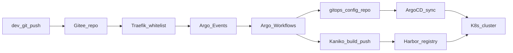

# SunmoonAI 四应用镜像构建方案（Cursor 版）

> 文档版本：v1.2 | 日期：2026-04-18 | 方案标识：**cursor**  
> **目录声明**：原 `app-platform/invest-app` **已删除**（删除操作在 **Claude** 会话中执行，与本文 Cursor 版文档分工区分，避免重复执行）。之后在 `app-platform/investment-app` 下新建部署树（目录名与 Gitee 仓库 **`investment-app`** 一致）。在 **`investment-app/`** 落地前，投资线业务的 K8s 生成配置与镜像名以 Gitee 与 gitops 为准。  
> 依据：[cicd总体架构及实施详细方案.md](./cicd总体架构及实施详细方案.md) 与仓库内 [app-platform](../app-platform/) 部署/源码镜像配置整理。  
> 并列文档：[build-images方案.md](./build-images方案.md)（Claude 版，侧重 **tpl-app 模板仓** 四子模块与 Kaniko 兼容性改造）；本文侧重 **已实例化的 SunmoonAI 四应用** 与现有 `app-platform` 配置对齐，二者范围不同、可互补阅读。

---

## 一、目标与验收标准

与总体 CI/CD 目标对齐（参见总体方案 §2.3），镜像构建侧应满足：

| 维度 | 验收要点 |
|------|----------|
| 可复现 | 同一 Git 提交构建出相同镜像 digest（依赖锁文件与基础镜像 tag 固定）。 |
| 可追溯 | 主推 **不可变 tag**：`<git-sha>`（短 SHA 或全 SHA，团队统一一种）。 |
| 仓库落地 | 构建产物推 **Harbor**（默认 `harbor.sunmoonai.com:30443`），项目与镜像名与 K8s 生成配置一致。 |
| GitOps 衔接 | CI 更新 **gitops-config** 中对应 Deployment/Rollout 的 image，ArgoCD 可 sync（总体方案落地后）。 |
| 过渡期 | 在 Argo Workflows 未上线前，现有 **Jenkins + Kaniko** 仍可按同一套命名/tag 规则执行，避免两套语义。 |

---

## 二、四应用镜像矩阵（核心）

说明：

- **Gitee 仓库名**以总体方案为准（`research-app`、`auth-app`、`llm-app`、`investment-app`）。**app-platform 侧**投资线将使用 **`investment-app/`** 目录（历史目录 **`invest-app/` 已从本仓库移除**）；组件与 Harbor 镜像名（如 `toutiao-app-front` / `toutiao-app-backend`）是否在迁移时重命名，由业务与 gitops 单独决议并在矩阵中更新。
- **Harbor 完整引用**形式：`${REGISTRY}/${PROJECT}/${IMAGE}:${TAG}`，默认 `REGISTRY=harbor.sunmoonai.com:30443`，`PROJECT=k8s-images`。
- **Dockerfile / mybuild**：源码侧惯例为各服务下的 `mybuild/`（`build.conf`、`Dockerfile`、`build-image.sh`）。下列「本仓库路径」指当前 monorepo 中可对照的路径；若与 Gitee 不一致，**以 Gitee 源码为准**。

### 2.1 research-app（Gitee）/ `app-platform/research-app`

| 组件 | 默认镜像名（Harbor 中） | 本仓库参考路径（mybuild / 说明） |
|------|-------------------------|----------------------------------|
| 前端 SSR | `incubator-app-front` | 部署脚本指向 `../mybuild`（见 `deploy-incubator-front`），**本树未包含 front 的 mybuild 目录**时以 Gitee 为准 |
| 后端 BFF | `incubator-app-backend` | 同上 |
| Celery Worker | **`celeryworker-incubator`**（见下「差距」） | [research-app/celeryworker-incubator/resources/source/mybuild/](../app-platform/research-app/celeryworker-incubator/resources/source/mybuild/) |

**Worker 与后端关系**：Worker 镜像为「运行时 + 依赖」，应用代码由 Init 从 **backend 镜像** 抽取挂载；CI 需同时构建/更新 **backend** 与 **worker** 镜像（或与后端版本联动的 tag）。

### 2.2 auth-app / `app-platform/auth-app`

| 组件 | 默认镜像名 | 本仓库参考 |
|------|------------|------------|
| 前端 | `auth-app-front` | `generate-app.conf` 见 [auth-app-front/.../generate-app.conf](../app-platform/auth-app/auth-app-front/resources/k8s-resource/custom-values/app/generate-app/generate-app.conf) |
| 后端 | `auth-app-backend` | [auth-app-backend/.../generate-app.conf](../app-platform/auth-app/auth-app-backend/resources/k8s-resource/custom-values/app/generate-app/generate-app.conf) |

本树 **未检出 auth 的 mybuild**，Dockerfile 路径以 Gitee 各服务 `mybuild` 为准。

### 2.3 llm-app / `app-platform/llm-app`

| 组件 | 默认镜像名 | 本仓库参考 |
|------|------------|------------|
| 前端 | `llmops-app-front` | [llmops-app-front/.../generate-app.conf](../app-platform/llm-app/llmops-app-front/resources/k8s-resource/custom-values/app/generate-app/generate-app.conf) |
| 后端 | `llmops-app-backend` | [llmops-app-backend/.../generate-app.conf](../app-platform/llm-app/llmops-app-backend/resources/k8s-resource/custom-values/app/generate-app/generate-app.conf) |
| Celery Worker | **`celeryworker-llmops`**（见下「差距」） | [llm-app/celeryworker-llmops/resources/source/mybuild/](../app-platform/llm-app/celeryworker-llmops/resources/source/mybuild/) |

### 2.4 investment-app（Gitee）/ 本仓库 `app-platform/investment-app`（待建）

总体方案与 ArgoCD 应用名为 **investment-app**。**历史目录** `app-platform/invest-app` **已删除**（见文首说明）；新建部署树目录名为 **`investment-app`**，与 Gitee 仓库名一致。

| 组件 | 默认镜像名（当前约定，迁移时可再定） | 本仓库参考 |
|------|--------------------------------------|------------|
| 前端 | `toutiao-app-front` | `investment-app/` 创建后，路径形如：`.../investment-app/<组件>/resources/k8s-resource/custom-values/app/generate-app/generate-app.conf`（**待补充链接**） |
| 后端 | `toutiao-app-backend` | 同上 |

**核对项**

- [x] 旧目录 `invest-app` 已从本仓库删除（Claude 会话执行）。
- [ ] 在 **`investment-app`** 下按现有 **research/auth/llm** 同款结构新建 front/backend（及后续 worker 等）部署与 `generate-app.conf`。
- [ ] Gitee `investment-app` 与 app-platform **`investment-app`** 目录、Harbor 镜像名、`mybuild/build.conf` **三者对齐**。
- [ ] 迁移完成后，将本文表格中的「本仓库参考」替换为实际 `generate-app.conf` 相对链接。

---

## 三、与总体 CI/CD 架构的衔接

总体方案规定：**Gitee → Webhook（Traefik 白名单）→ Argo Events → Argo Workflows（clone、测试、Kaniko、推 Harbor、改 gitops-config、触发 ArgoCD sync）**。镜像构建方案不改变这一链路，只约束 **Workflow 中 Kaniko 步骤的输入输出**：

- **输入**：仓库 URL、**commit SHA**、Dockerfile 路径、构建上下文、（可选）`HTTP_PROXY` / `NO_PROXY` 等 build-arg。
- **输出**：Harbor 中的 **带 SHA 的 tag** + gitops 仓库中 image 字段更新。

---

## 四、现状差距分析（是否满足「上 app-platform + 后续全自动 CICD」）

### 4.1 已具备的基础

- Harbor 与项目命名习惯（`k8s-images`）已在各 `generate-app.conf` 中统一。
- Celery Worker 采用 **多阶段 `python:3.11-slim` + venv**，与 [Dockerfile构建优化-从inboard到标准Python镜像.md](../docs/Dockerfile构建优化-从inboard到标准Python镜像.md) 方向一致；Worker Dockerfile 在 mybuild 中可版本化。
- `mybuild/build-image.sh`、`build.conf` 已抽象镜像名、tag、registry、推送开关，便于迁移到 Kaniko 时做 **参数对齐**。

### 4.2 待补齐或需统一

| 项 | 说明 |
|----|------|
| **Celery 镜像名默认值不一致** | `research-app` / `llm-app` 的 `build.conf` 默认镜像名为 **`celeryworker-incubator`**、**`celeryworker-llmops`**，而对应 `generate-app.conf` 默认 **`CELERY_WORKER_IMAGE=celeryworker`**。若部署时未通过环境变量覆盖，可能导致 **拉错镜像或拉不到**。CI/GitOps 应以 **单一真源**（建议 `build.conf` + gitops 一致）统一为带业务前缀的名称。 |
| **本地构建 vs Kaniko** | 脚本中 `docker`/`nerdctl` 需在 CI 中映射为 Kaniko：`--dockerfile`、`--context`、与 `build.conf` 等价的 `--build-arg`。 |
| **多服务 per 仓库** | 一次 push 可能需构建 **多个镜像**（front、backend、worker）；Workflow 宜用 **并行 step** 或 **矩阵参数**，避免遗漏 worker。 |
| **前端 Node 构建** | Nuxt/Vue 等多阶段构建需在 Dockerfile 中固定 Node 版本与 lockfile；与后端 Python 镜像 **分轨构建、分轨 tag**。 |
| **可选**：Harbor 镜像扫描、SBOM 导出 | 作为质量门禁，不改变主链路。 |

---

## 五、Cursor 版推荐流水线形状（原则级）

不绑定具体 YAML 文件名（实现细节见总体方案 §4.3），推荐：

1. **触发**：Gitee Webhook → Argo Events（分支过滤 `main` / `develop` 等与总体方案一致）。
2. **Workflow**：`WorkflowTemplate` 参数化 `repo`、`commit`、`service_list`（或 `app` + 自动发现 mybuild）。
3. **步骤**：`git clone`（指定 SHA）→ 可选 `lint`/`unit test` → **每个镜像一次 Kaniko** → push Harbor → **git 提交 gitops-config**（更新 image tag）→ 可选 **ArgoCD CLI/API sync**。
4. **四仓库策略**：四个 **Sensor** 或 **四个 Workflow** 模板实例；或 **一个模板 + `repo` 参数**，由团队维护映射表（与总体方案 §3.2 目录一致）。

---

## 六、命名与版本策略

- **Registry**：`harbor.sunmoonai.com:30443`（与各 `generate-app.conf` 默认一致）。
- **项目**：默认 `k8s-images`；若 Harbor 项目分层（如按业务线），需在 **gitops 与 CI 变量**同步修改，避免只改一侧。
- **Tag**：
  - **主推荐**：`:<git-sha>` 作为不可变发布单元。
  - **辅助**：可为环境保留移动 tag（如 `:dev-latest`），仅用于开发联调；生产以 SHA 为准。
- **同一 Celery 与 Backend**：Init 容器依赖 backend 镜像 tag；**同一发布** 应使用 **同一 SHA 或同一发布号**，避免代码版本错配。

---

## 七、Secrets 与合规

- Harbor 推送使用 **Robot Account** 或等价凭据，以 Kubernetes Secret 注入 Kaniko，**不**写入 Dockerfile 与 Git 历史。
- 构建期代理：与现有 Dockerfile 中 `ARG HTTP_PROXY` 等对齐；**NO_PROXY** 需包含内网 Harbor、Gitee 等，避免流量误走代理。
- 运行时密钥仅通过 **K8s Secret / External Secrets** 挂载，**不** `COPY .env` 进镜像。

---

## 八、与 [build-images方案.md](./build-images方案.md)（Claude 版）的关系与合并评审

| 维度 | 本文（Cursor） | [build-images方案.md](./build-images方案.md)（Claude） |
|------|----------------|------------------------------------------------------|
| 对象 | SunmoonAI 四应用：`research-app`、`auth-app`、`llm-app`、`investment-app`（及 `app-platform` 中镜像名） | **tpl-app** 模板：tpl-admin-frontend/backend、tpl-web-frontend/backend |
| Harbor | 与现有部署一致，默认 **`k8s-images/<服务名>`** | 建议独立 Harbor 项目 **`apps/<service-name>`**（与基础设施镜像区分） |
| 侧重点 | 矩阵、与 `generate-app.conf` / mybuild 对齐、Celery 命名一致性 | Dockerfile 改造、**Kaniko 不支持 BuildKit `--mount=cache`**、根目录 `Dockerfile` 规范、示例 Dockerfile |

**可统一的技术原则**（两文均与总体 CI/CD 一致）：不可变 tag（git SHA）、基础镜像走 Harbor、Kaniko 兼容（避免 BuildKit 专有语法）、Secrets 不进镜像层。

**仅针对 SunmoonAI 落地时**，仍以本文矩阵与 `k8s-images` 为准；**从 tpl-app 实例化新项目时**，可参考 Claude 文的 Dockerfile 改造与命名替换（`init.sh` 等），再在具体业务的 `generate-app.conf` 中固化 Harbor 坐标。

**合并评审时可对齐**：Tag 策略、gitops 谁写、Harbor 项目用 `k8s-images` 还是另建 `apps`（若采用 Claude 文的 `apps` 项目，需同步改所有已上线 `generate-app.conf` 与 gitops，避免混用）。

---

## 九、附录：本仓库关键引用路径

| 说明 | 路径 |
|------|------|
| 总体 CI/CD 方案 | [cicd总体架构及实施详细方案.md](./cicd总体架构及实施详细方案.md) |
| Research Celery mybuild | [research-app/.../mybuild/Dockerfile](../app-platform/research-app/celeryworker-incubator/resources/source/mybuild/Dockerfile) |
| LLM Celery mybuild | [llm-app/.../mybuild/Dockerfile](../app-platform/llm-app/celeryworker-llmops/resources/source/mybuild/Dockerfile) |
| Python 镜像与 inboard 说明 | [Dockerfile构建优化-从inboard到标准Python镜像.md](../docs/Dockerfile构建优化-从inboard到标准Python镜像.md) |

---

*本文件为 Cursor 版方案（后缀 cursor）；实施时以 Gitee 最新源码与 Harbor 实际项目名为准。*
